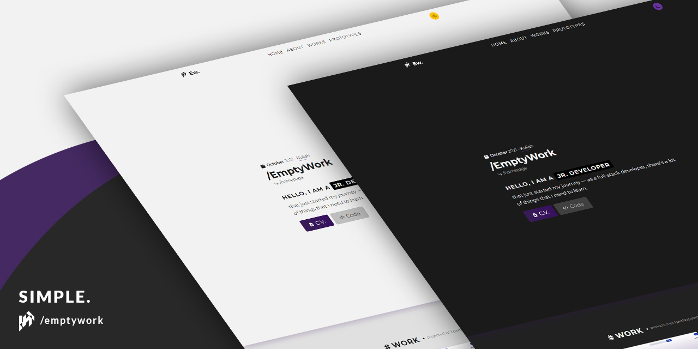

<h1 align="center"> EmptyWork Pung Website</h1>

  
 
  

## Tentang  
Baca akang pake: <a href="README.md">Bahasa Inggris</a>, <a href="README.id-ID.md">Bahasa Indonesia</a>

Kode sumber par beta pung website. 
Beta biking akang repository ni par kase tuju kode yang beta su tulis  deng par jadi bukti beta pung kemampuan par karja pake Javascript, HTML5 deng CSS3.
