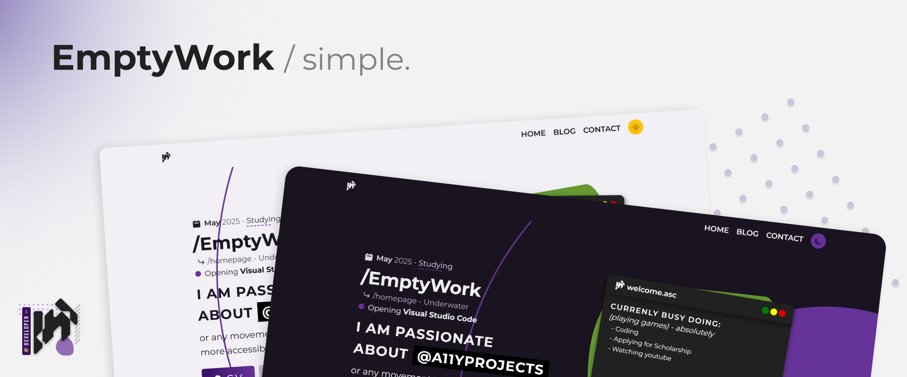

```
id: Dokumen ini belum di perbaharui ke versi terbaru. Silahkan baca versi Bahasa Inggris dari dokuemn ini.
abs-id: Ni dokumen akang balom dapa biking jadi baru. babaca akang pung versi bahasa Inggris jua. 
en: This documents is not updated to the latest version. please read the english version of it. 
```

[]()
[]()
[](https://github.com/EmptyWork/emptywork.github.io/blob/master/LICENSE)
[](https://app.netlify.com/sites/emptywork/deploys)

[**⚠Laporkan Bug**](https://github.com/EmptyWork/emptywork.github.io/issues/new) — [**📧Minta Fitur**](https://github.com/EmptyWork/emptywork.github.io/issues/new)

**Bahasa Lain: [🆔Bahasa Ambon](README.abs-ID.md), [🅰Bahasa Inggris](README.md)**

## Sumber kode untuk website pribadi EmptyWork

[EmptyWork](https://emptywork.github.io) adalah website yang responsive, memiliki design multi-page untuk website blog dengan menggunakan [11ty](https://www.11ty.dev/) sebagai Static Site Generator, [Nunjuck](https://mozilla.github.io/nunjucks/templating.html) sebagai bahasa templatingnya, dan [NetlifyCMS](https://www.netlifycms.org/) untuk Content Management

Kamu bisa `fork` atau `clone` repository ini untuk _mengubah_ dan membuat perubahan sesuai keinginan kamu, dan kamu [**tidak diwajibkan**](https://github.com/EmptyWork/emptywork.github.io/blob/master/LICENSE) untuk memberikan kredit ke saya, tapi jika kamu mau memberi kredit tolong berikan kepada [EmptyWork](https://github.com/EmptyWork).

## Table Konten

- [Instalasi](#instalasi)
- [Dukungan](#dukungan)

### Instalasi

`clone` atau `fork` repository ini, jika kamu melakukan `fork` kamu bisa mengubah nama repositorynya sesuai dengan milik kamu, sedangkan jika kamu `clone` maka buatlah sebuah repository baru dan upload file. Pastikan kamu memiliki [node.js](https://nodejs.org) dan `npm` pada perangkat kalian.

Setelah itu ikuti langkah-langkah berikut:

- Pergi ke direktori lokal dimana kalian menyimpan file hasil `fork` atau `clone`
- Kemudian lakukan `npm install`
- Jalankan `npm run build` atau `npm start` jika kamu mau menggubah filenya.

### Dukungan

Berikan ⭐ jika kamu mau! dan ikuti [EmptyWork](https://github.com/EmptyWork).
