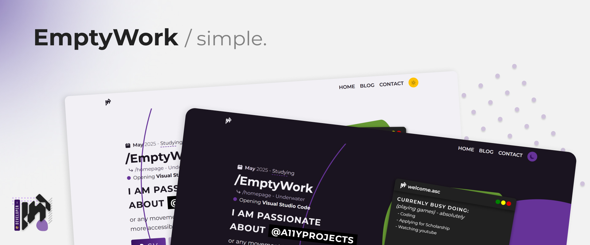
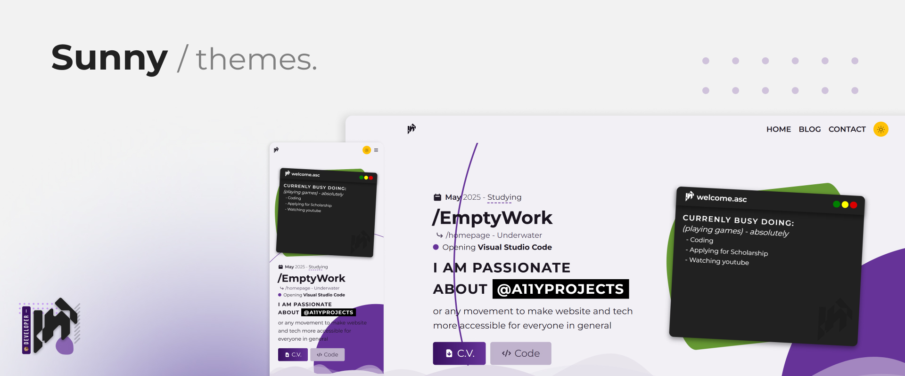
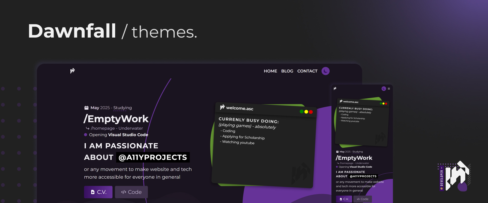
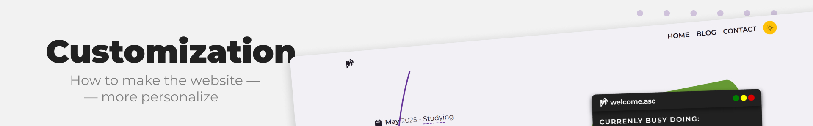
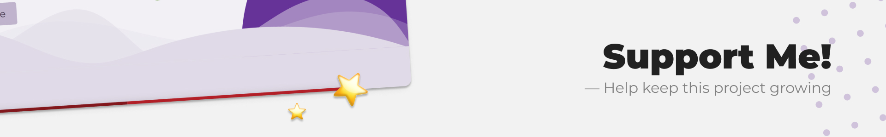

[**⚠ Report Bug**](https://github.com/EmptyWork/emptywork.github.io/issues/new) — [**📧 Request Feature**](https://github.com/EmptyWork/emptywork.github.io/issues/new)

**Read this in: [🆔Ambonese Malay](README.abs-ID.md), [🆔Indonesian](README.id-ID.md)**

## EmptyWork's personal website sourcecode

[EmptyWork](https://emptywork.github.io) is a fully responsive, multi-page layout JAMStack blog—website built using [11ty](https://www.11ty.dev/) as the Static Site Generator, [Nunjuck](https://mozilla.github.io/nunjucks/templating.html) templating language, and [NetlifyCMS](https://www.netlifycms.org/) for Content Management

You can `fork` or `clone` this repo to _modify_ and make changes of your own, and it's [**not required**](https://github.com/EmptyWork/emptywork.github.io/blob/master/LICENSE) for you to credit me, but if you want you can properly linking back the credit to [EmptyWork](https://github.com/EmptyWork).

## Table of Contents

- [Themes](#themes)
- [Installation](#installation)
- [Customization](#customization)
- [Support](#support-me!)

### Themes

[EmptyWork](https://emptywork.github.io) is mobile-friendly and accessible-first oriented design, it comes with `2 (two) modes`: sunny _(lightmode)_ and dawnfall _(darkmode)_.

#### Sunny / theme

#### Dawnfall / theme

**ps:** the website also `support custom color schemes`, you can access _[_vars.scss](src/assets/scss/abstracts/_vars.scss) to adjust it_.

### Installation

`clone` or `fork` this repository and in case you `forked` then you just need to modify the name of repo else if you `cloned` then create a new repo and upload the file. Make sure you have [node.js](https://nodejs.org) and `npm` installed on your local device.

After that follow this steps:

- Go to your local directory and then do `npm install`
- Run the `npm run build` or `npm run start` if you want to start edit the file, other option is by `npm run dev`.

### Customization

Once you are done with [installation](#installation), here is few steps for you to setting up the website:

- Go to [data folder](src/_data/) to edit the data, it contains most of landing-page information _(editable)_, most of them are support markdown syntax.
- Next go to [articles folder](src/articles/) to remove the pre-existing `blog-post`, `prototypes` and `projects`.
- For more in-depth edit, you can just change it on individual template file _(planned to be more modular in the future)_.

### Support Me!

Give a ⭐ to this repo if you like it! And follow [EmptyWork](https://github.com/EmptyWork).
