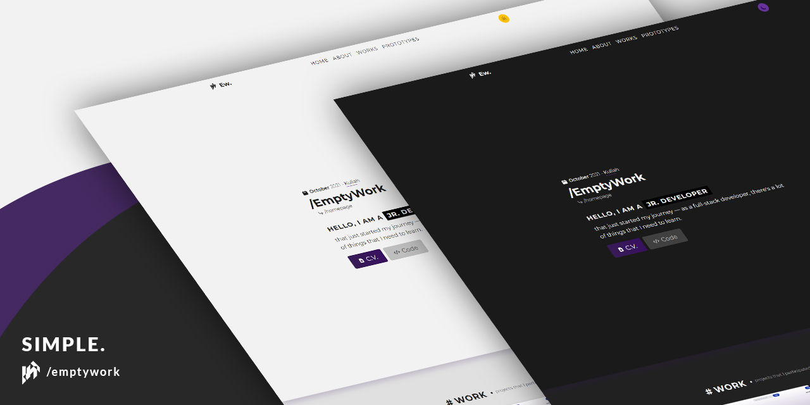

<h1 align="center"> EmptyWork's Personal Website</h1>

  
 
  

## About 
Read this in: <a href="README.abs-ID.md">Ambonese Malay</a>, <a href="README.id-ID.md">Indonesian</a>

Source code for my personal website. 
The purpose of this repository is to showcase the code that I wrote  and as a proof of my ability to work with Javascript, HTML5 and CSS3.

